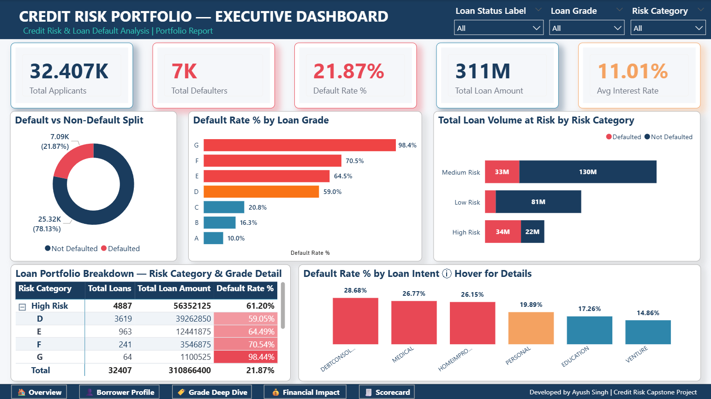
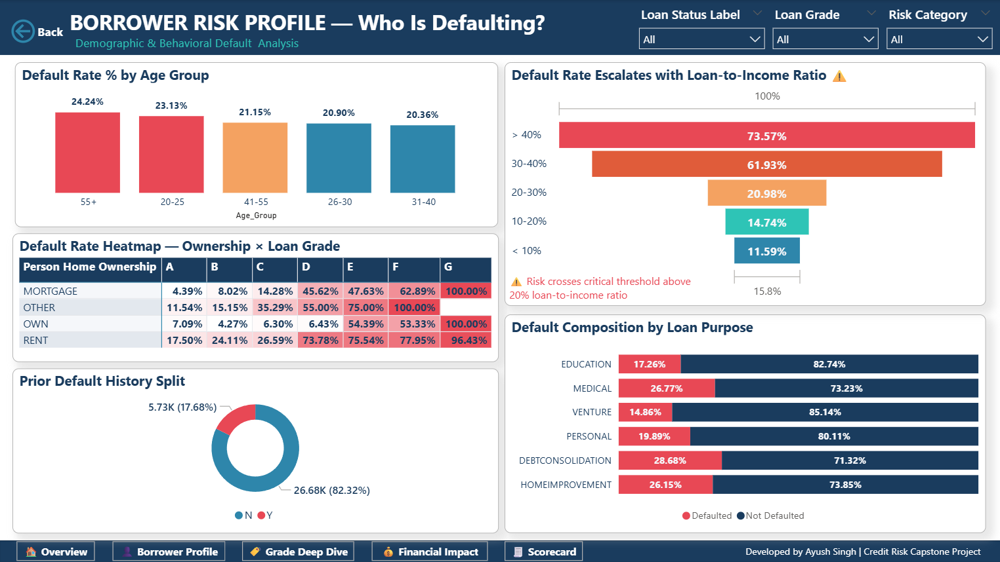
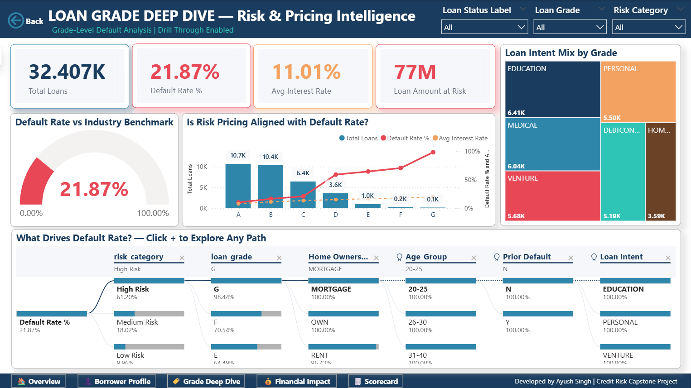
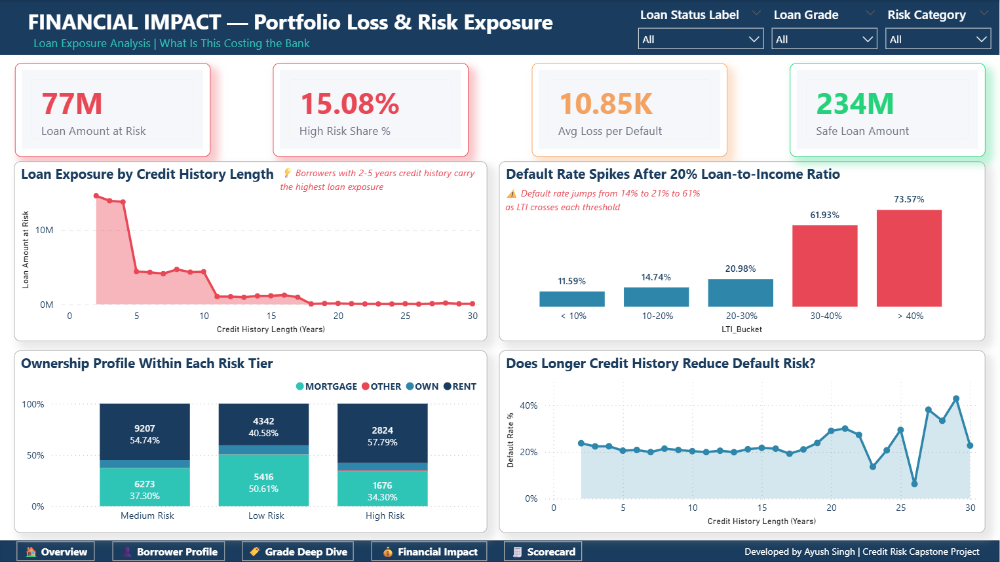
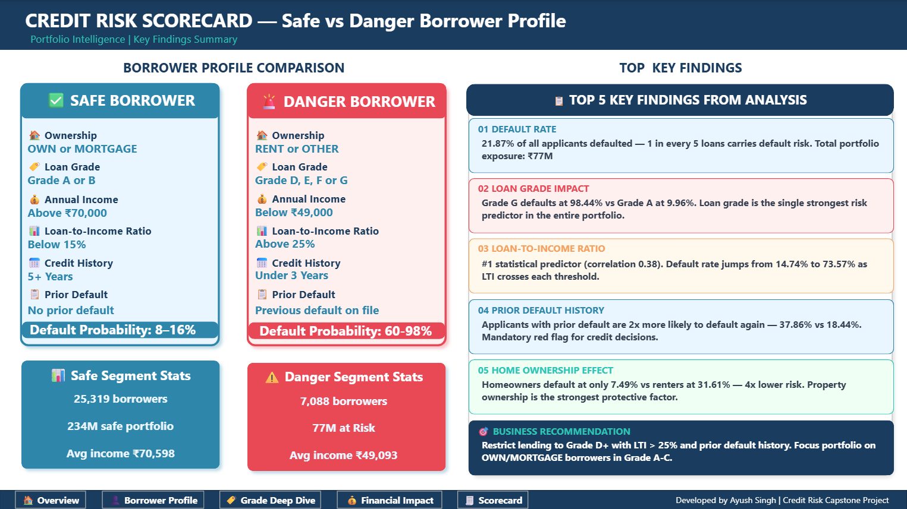

# 🏦 Credit Risk & Loan Default Analysis
### End-to-End Data Analytics Capstone Project


---

## 📌 Project Overview

This is a **full end-to-end data analytics capstone project** simulating a real-world credit risk engagement at a bank or financial institution. As a Data Analyst, I received a brief from a panel of senior stakeholders — including a Chief Risk Officer, CFO, Credit Policy Team, and Loan Committee — each with critical, business-specific questions about their loan portfolio.

The result is a **4-phase analytical pipeline** starting from raw, uncleaned data and ending with a **5-page interactive Power BI dashboard** built on 32,407 loan records — designed to identify default patterns, quantify financial exposure, and enable data-driven lending decisions.

This project covers the **complete lifecycle of a data analyst's work**:

> `Raw Data → Excel Cleaning → MySQL Analysis → Statistical Insights → Power BI Dashboard`

---

## 🏢 Business Context — The Problem

A bank's credit risk leadership team identified several critical gaps in their loan portfolio visibility:

- 📉 **No unified default rate view** — leadership had no single number for overall portfolio health
- 🏷️ **Grade-level blindspot** — no visibility into which loan grades were generating most defaults
- 💸 **Unknown financial exposure** — CFO couldn't quantify total loan amount at risk from probable defaulters
- 🔍 **No borrower profiling** — credit policy team had no data-backed definition of a "safe" vs "danger" borrower
- 📊 **No statistical validation** — decisions were made on assumptions, not correlation or significance
- ⚠️ **No risk pricing analysis** — no way to verify whether interest rates were aligned with actual default risk per grade
- 🎚️ **No simulation capability** — no tool to model "what if we tighten lending criteria?"

---

## 🎯 Stakeholder Questions — Real World Business Brief

These are the exact questions posed by each stakeholder team. Every visual in the dashboard directly answers one or more of these questions.

### 👔 Chief Risk Officer (CRO)
1. *"What is our current portfolio default rate and how does it break down by risk grade?"*
2. *"Which combination of loan grade + loan intent creates the highest default concentration?"*
3. *"If a customer has defaulted before, is renting, and is applying for debt consolidation — what is their compounded default risk?"*

### 💰 CFO
4. *"What is the total loan amount at risk from high-probability defaulters?"*
5. *"Show me the interest rate spread between defaulters and non-defaulters — are we charging enough risk premium?"*
6. *"If we reject all applicants above a certain loan-to-income threshold — how much does our default rate drop?"*

### 📋 Loan Committee
7. *"Give me a full profile of our riskiest applicant segment — age, income, ownership, employment, intent, grade — on one screen."*
8. *"What % of our total loan portfolio sits in High Risk category and what is the total amount at risk?"*

### 📈 Data Analytics Team
9. *"Which single variable is the strongest statistical predictor of default?"*
10. *"At what loan-to-income ratio does default risk cross a critical threshold?"*
11. *"Does longer credit history actually protect against default, or is it statistically insignificant?"*
12. *"Are repeat defaulters concentrated in specific loan grades?"*

---

## ⭐ STAR Method

### 🔵 Situation
A bank's credit risk team had 32,000+ loan records across multiple risk grades, income brackets, and borrower profiles — but no analytical framework to identify default patterns, quantify financial exposure, or build a data-backed lending policy. The credit committee was making decisions on gut feeling, not data.

### 🟡 Task
Design and deliver a complete, production-grade analytical solution — from raw data cleaning through to an interactive Power BI dashboard — answering 12 stakeholder questions across credit risk, borrower demographics, financial impact, and portfolio simulation.

### 🟠 Action

**Phase 1 — Excel Data Cleaning:**
- ✅ Removed **165 duplicate rows** (0.5% of data) using Remove Duplicates
- ✅ Identified and removed **7 rows with impossible ages** (84, 94, 123, 144 years) — data entry errors
- ✅ Removed **2 rows with employment length = 123 years** — impossible value
- ✅ Flagged **8 income outliers above ₹10,00,000** with a new `income_outlier_flag` column rather than deleting — valid real-world scenarios
- ✅ Filled **3,116 missing `loan_int_rate` values** with median (10.99%) — median chosen over mean to avoid outlier influence
- ✅ Filled **887 missing `person_emp_length` values** with median (4.0 years)
- ✅ Created `loan_status_label` column: binary 0/1 → human-readable "Defaulted/Not Defaulted"
- ✅ Created `risk_category` column: grouped loan grades A=Low Risk, B/C=Medium Risk, D/E/F/G=High Risk
- ✅ Documented all changes in a dedicated `Cleaning_Log` sheet
- ✅ Preserved original raw data in `Raw_Data` sheet — professional data integrity standard

**Phase 2 — MySQL Analysis:**
- ✅ Imported cleaned CSV into MySQL Workbench (`credit_risk_db`)
- ✅ Wrote **10 business queries** covering default rates by grade, intent, ownership, age group, and prior history
- ✅ Used `COUNTIFS`, `GROUP BY`, `CASE WHEN`, `ROUND`, `DIVIDE` and window-style aggregations
- ✅ Built a compound risk query combining grade + intent + ownership in a single analysis

**Phase 3 — Statistical Analysis:**
- ✅ Computed **Pearson Correlation Coefficients** for all 7 numerical variables against loan default
- ✅ Performed **IQR-based outlier detection** on income, loan amount, and interest rate
- ✅ Built **descriptive statistics table** — count, mean, min, max, std dev, median for all numerical columns
- ✅ Created **defaulter vs non-defaulter comparative profile** using AVERAGEIF formulas in Excel
- ✅ Documented all 9 statistical findings with insights in a dedicated `Statistical_Findings` sheet

**Phase 4 — Power BI Dashboard:**
- ✅ Applied a fully custom **Credit Sentinel color theme** — manually configured dark navy background (`#0A0E1A`), gold titles (`#F59E0B`), red/blue/green accent system across all 5 pages
- ✅ Created a dedicated **`_Measures` table** to store all 15 DAX measures — professional BI development standard
- ✅ Wrote **15 DAX measures** including Default Rate %, Filtered Default Rate (What-If), and Avg Income by status
- ✅ Created **2 Power Query calculated columns** — `Age_Group` and `LTI_Bucket` — for demographic segmentation
- ✅ Built **Drill-Through** from any grade-level chart to a dedicated Grade Deep Dive page
- ✅ Built **2 Custom Tooltip Pages** — one for Loan Intent hover stats, one for Treemap grade detail
- ✅ Implemented a **What-If Parameter** for live loan-to-income threshold simulation
- ✅ Used **Conditional Formatting** with color scale rules across bar charts and matrix heatmaps
- ✅ Built a **Decomposition Tree** for interactive, free-form root cause exploration of default rate
- ✅ Designed a **Scorecard page** using only shapes and text boxes — comparing Safe vs Danger borrower profiles
- ✅ Added navigation buttons, back button, branding strip, and insight text boxes across all 5 pages

### 🟢 Result

| Metric | Finding |
|---|---|
| Overall Default Rate | **21.87%** — 1 in every 5 loans defaults |
| Top Predictor | Loan-to-income ratio — correlation **+0.38** |
| Grade G Default Rate | **98.44%** — nearly guaranteed default |
| Grade A Default Rate | **9.96%** — safest segment |
| Prior Default Impact | **2x higher** risk — 37.86% vs 18.44% |
| Renter Default Rate | **31.61%** vs Homeowners at 7.49% |
| Total Amount at Risk | **₹77M** from defaulted loans |
| Safe Portfolio | **₹234M** in non-defaulted loans |
| LTI Critical Threshold | Default rate jumps from **20.98% to 61.93%** after 30% LTI |
| Risk Pricing Gap | Interest rate rises slowly after Grade C while default rate spikes — bank **underpricing risk** on Grade D+ |

---

## 🗄️ Dataset Information

| Property | Detail |
|---|---|
| Source | [Kaggle — Credit Risk Dataset](https://www.kaggle.com/datasets/laotse/credit-risk-dataset) |
| Raw Rows | 32,582 |
| Cleaned Rows | **32,407** (175 removed) |
| Columns (Original) | 12 |
| Columns (After Feature Engineering) | **15** (3 new columns added) |
| Domain | Banking & Financial Services |
| Target Variable | `loan_status` — 0 = Not Defaulted, 1 = Defaulted |

### Column Dictionary

| Column | Type | Description |
|---|---|---|
| `person_age` | Integer | Applicant's age in years |
| `person_income` | Integer | Annual income |
| `person_home_ownership` | Categorical | RENT / OWN / MORTGAGE / OTHER |
| `person_emp_length` | Float | Employment length in years |
| `loan_intent` | Categorical | PERSONAL / EDUCATION / MEDICAL / VENTURE / HOMEIMPROVEMENT / DEBTCONSOLIDATION |
| `loan_grade` | Categorical | A (safest) → G (riskiest) |
| `loan_amnt` | Integer | Loan amount requested |
| `loan_int_rate` | Float | Interest rate % |
| `loan_status` | Binary | 🎯 **Target** — 0 = Not Defaulted, 1 = Defaulted |
| `loan_percent_income` | Float | Loan amount as % of annual income |
| `cb_person_default_on_file` | Binary | Y = Prior default history, N = Clean |
| `cb_person_cred_hist_length` | Integer | Credit history length in years |
| `income_outlier_flag` ⭐ | Integer | **New** — 1 = income above ₹10L, 0 = normal |
| `loan_status_label` ⭐ | Text | **New** — "Defaulted" / "Not Defaulted" |
| `risk_category` ⭐ | Text | **New** — "Low Risk" / "Medium Risk" / "High Risk" |

---

## 🔄 Project Architecture

```
📁 Raw Dataset (Kaggle)
        │
        ▼
┌─────────────────────┐
│   Phase 1 — Excel   │  ← Cleaning, outlier removal, feature engineering
│   Data Cleaning     │  ← 3 new columns, Cleaning_Log documentation
└─────────────────────┘
        │
        ▼
┌─────────────────────┐
│   Phase 2 — MySQL   │  ← 10 business queries
│   SQL Analysis      │  ← GROUP BY, CASE WHEN, aggregations
└─────────────────────┘
        │
        ▼
┌─────────────────────┐
│  Phase 3 — Stats    │  ← Pearson correlation, IQR outliers
│  Statistical Fin.   │  ← 9 findings, comparative profiling
└─────────────────────┘
        │
        ▼
┌─────────────────────┐
│  Phase 4 — Power BI │  ← 5-page dashboard, 15 DAX measures
│  Dashboard          │  ← Drill Through, Tooltip, What-If, Decomp Tree
└─────────────────────┘
        │
        ▼
📊 Interactive Dashboard + Business Recommendations
```

---

## 📊 Phase 1 — Excel Data Cleaning

### Cleaning Steps Performed

| Step | Issue Found | Action Taken | Rows Affected |
|---|---|---|---|
| 1 | 165 duplicate rows | Removed using Remove Duplicates | 165 |
| 2 | Age outliers (84, 94, 123, 144) | Deleted rows — data entry errors | 7 |
| 3 | Employment length = 123 years | Deleted rows — impossible value | 2 |
| 4 | Income > ₹10,00,000 | Flagged with `income_outlier_flag` — not removed | 8 |
| 5 | 3,116 missing `loan_int_rate` | Filled with median 10.99% | 3,116 |
| 6 | 887 missing `person_emp_length` | Filled with median 4.0 years | 887 |
| 7 | Binary `loan_status` unreadable | Added `loan_status_label` column | All rows |
| 8 | No risk grouping | Added `risk_category` column | All rows |

### Excel Sheets Structure
```
credit_risk_cleaned.xlsx
├── Raw_Data              ← Original untouched data (never modified)
├── Cleaned_Data          ← Working dataset with all 15 columns
├── Cleaning_Log          ← Full documentation of every change
└── Statistical_Findings  ← 9 statistical analyses with formulas
```

---

## 🗄️ Phase 2 — SQL Analysis

### Database Setup
```sql
CREATE DATABASE credit_risk_db;
USE credit_risk_db;
```

### Business Queries (10 Total)

**Query 1 — Overall Default Rate**
```sql
SELECT
    COUNT(*) AS total_applicants,
    SUM(loan_status) AS total_defaulters,
    ROUND(SUM(loan_status) * 100.0 / COUNT(*), 2) AS default_rate_percent
FROM credit_risk;
```
> Result: 21.87% overall default rate across 32,407 applicants

**Query 2 — Default Rate by Loan Grade**
```sql
SELECT
    loan_grade,
    COUNT(*) AS total_loans,
    SUM(loan_status) AS defaults,
    ROUND(SUM(loan_status) * 100.0 / COUNT(*), 2) AS default_rate_percent
FROM credit_risk
GROUP BY loan_grade
ORDER BY loan_grade;
```
> Result: Grade A = 9.96% → Grade G = 98.44% — perfect risk gradient

**Query 3 — Default Rate by Home Ownership**
```sql
SELECT
    person_home_ownership,
    COUNT(*) AS total_applicants,
    SUM(loan_status) AS defaults,
    ROUND(SUM(loan_status) * 100.0 / COUNT(*), 2) AS default_rate_percent
FROM credit_risk
GROUP BY person_home_ownership
ORDER BY default_rate_percent DESC;
```
> Result: RENT (31.61%) vs OWN (7.49%) — 4x difference

**Query 4 — Default Rate by Loan Intent**
```sql
SELECT
    loan_intent,
    COUNT(*) AS total_loans,
    SUM(loan_status) AS defaults,
    ROUND(SUM(loan_status) * 100.0 / COUNT(*), 2) AS default_rate_percent
FROM credit_risk
GROUP BY loan_intent
ORDER BY default_rate_percent DESC;
```
> Result: DEBTCONSOLIDATION highest (28.68%), VENTURE lowest (14.86%)

**Query 5 — Defaulters vs Non-Defaulters Comparison**
```sql
SELECT
    loan_status_label,
    ROUND(AVG(loan_amnt), 2) AS avg_loan_amount,
    ROUND(AVG(loan_int_rate), 2) AS avg_interest_rate,
    ROUND(AVG(person_income), 2) AS avg_income,
    ROUND(AVG(loan_percent_income), 2) AS avg_loan_to_income_ratio
FROM credit_risk
GROUP BY loan_status_label;
```
> Result: Defaulters earn ₹21,505 less and pay 2.39% higher interest rate

**Query 6 — Default Rate by Age Group**
```sql
SELECT
    CASE
        WHEN person_age BETWEEN 20 AND 25 THEN '20-25'
        WHEN person_age BETWEEN 26 AND 30 THEN '26-30'
        WHEN person_age BETWEEN 31 AND 40 THEN '31-40'
        WHEN person_age BETWEEN 41 AND 55 THEN '41-55'
        ELSE '55+'
    END AS age_group,
    COUNT(*) AS total,
    SUM(loan_status) AS defaults,
    ROUND(SUM(loan_status) * 100.0 / COUNT(*), 2) AS default_rate_percent
FROM credit_risk
GROUP BY age_group
ORDER BY default_rate_percent DESC;
```

**Query 7 — Prior Default History Impact**
```sql
SELECT
    cb_person_default_on_file AS previous_default,
    COUNT(*) AS total_applicants,
    SUM(loan_status) AS current_defaults,
    ROUND(SUM(loan_status) * 100.0 / COUNT(*), 2) AS default_rate_percent
FROM credit_risk
GROUP BY cb_person_default_on_file;
```
> Result: Prior defaulters have 2x higher default rate (37.86% vs 18.44%)

**Query 8 — Risk Category Portfolio Summary**
```sql
SELECT
    risk_category,
    COUNT(*) AS total_loans,
    ROUND(COUNT(*) * 100.0 / (SELECT COUNT(*) FROM credit_risk), 2) AS portfolio_share,
    SUM(loan_status) AS defaults,
    ROUND(SUM(loan_status) * 100.0 / COUNT(*), 2) AS default_rate_percent,
    ROUND(AVG(loan_int_rate), 2) AS avg_interest_rate
FROM credit_risk
GROUP BY risk_category
ORDER BY default_rate_percent DESC;
```

**Query 9 — High Risk Applicant Profile (Top 10 Combinations)**
```sql
SELECT
    loan_grade,
    loan_intent,
    person_home_ownership,
    COUNT(*) AS total,
    ROUND(AVG(loan_int_rate), 2) AS avg_rate,
    ROUND(AVG(loan_amnt), 2) AS avg_loan,
    ROUND(SUM(loan_status) * 100.0 / COUNT(*), 2) AS default_rate_percent
FROM credit_risk
WHERE risk_category = 'High Risk'
GROUP BY loan_grade, loan_intent, person_home_ownership
ORDER BY default_rate_percent DESC
LIMIT 10;
```

**Query 10 — Credit History vs Default Rate**
```sql
SELECT
    cb_person_cred_hist_length AS credit_history_years,
    COUNT(*) AS total_applicants,
    SUM(loan_status) AS defaults,
    ROUND(SUM(loan_status) * 100.0 / COUNT(*), 2) AS default_rate_percent
FROM credit_risk
GROUP BY cb_person_cred_hist_length
ORDER BY cb_person_cred_hist_length;
```
> Result: No consistent trend — confirms statistical finding of -0.02 correlation

---

## 📈 Phase 3 — Statistical Analysis

### Finding 1 — Descriptive Statistics

| Column | Mean | Min | Max | Std Dev | Median |
|---|---|---|---|---|---|
| person_age | 27.73 | 20 | 80 | 6.19 | 26 |
| person_income | 65,894 | 4,000 | 20,39,784 | 52,518 | 55,000 |
| loan_amnt | 9,592 | 500 | 35,000 | 6,321 | 8,000 |
| loan_int_rate | 11.01% | 5.42% | 23.22% | 3.08% | 10.99% |
| loan_percent_income | 0.17 | 0.00 | 0.83 | 0.11 | 0.15 |
| cb_person_cred_hist_length | 5.81 | 2 | 30 | 4.06 | 4 |
| person_emp_length | 4.76 | 0 | 41 | 3.98 | 4 |

### Finding 2 — Overall Default Rate
| Metric | Value |
|---|---|
| Total Applicants | 32,407 |
| Total Defaulters | 7,088 |
| Non-Defaulters | 25,319 |
| **Default Rate** | **21.87%** |

### Finding 3 — Pearson Correlation with Loan Default

| Variable | Correlation | Direction | Strength |
|---|---|---|---|
| `loan_percent_income` | **+0.38** | 🔴 Positive | Moderate — Strongest predictor |
| `loan_int_rate` | **+0.32** | 🔴 Positive | Moderate |
| `loan_amnt` | +0.11 | 🟡 Positive | Weak |
| `person_income` | -0.17 | 🟢 Negative | Weak — Protective factor |
| `person_emp_length` | -0.09 | 🟢 Negative | Negligible |
| `person_age` | -0.02 | ⚪ Negative | Negligible |
| `cb_person_cred_hist_length` | -0.02 | ⚪ Negative | Negligible |

> **Key Insight:** Loan-to-income ratio is the #1 predictor of default. Income is a protective factor. Age and credit history have almost zero predictive power.

### Finding 4 — Defaulters vs Non-Defaulters Profile

| Metric | ✅ Not Defaulted | ❌ Defaulted | Difference |
|---|---|---|---|
| Avg Age | 27.80 yrs | 27.48 yrs | 0.32 yrs (negligible) |
| Avg Income | ₹70,598 | ₹49,093 | **₹21,505 less** |
| Avg Interest Rate | 10.49% | 12.88% | **+2.39% higher** |
| Avg Loan-to-Income | 0.15 | 0.25 | **+67% higher ratio** |

### Finding 5 — Default Rate by Loan Grade

| Grade | Total | Defaults | Default Rate | Risk Level |
|---|---|---|---|---|
| A | 10,701 | 1,066 | 9.96% | 🟢 Safe |
| B | 10,384 | 1,695 | 16.32% | 🟢 Acceptable |
| C | 6,435 | 1,336 | 20.76% | 🟡 Caution |
| D | 3,619 | 2,137 | 59.05% | 🔴 High Risk |
| E | 963 | 621 | 64.49% | 🔴 High Risk |
| F | 241 | 170 | 70.54% | 🔴 Very High |
| G | 64 | 63 | **98.44%** | ☠️ Critical |

### Finding 6 — Prior Default History Impact

| Prior Default | Total | Defaults | Default Rate |
|---|---|---|---|
| No (N) | 26,678 | 4,919 | 18.44% |
| Yes (Y) | 5,729 | 2,169 | **37.86%** |

> Prior defaulters are **2.05x more likely** to default again.

### Finding 7 — Default Rate by Loan Intent

| Intent | Total | Defaults | Default Rate |
|---|---|---|---|
| DEBTCONSOLIDATION | 5,189 | 1,488 | **28.68%** 🔴 |
| MEDICAL | 6,041 | 1,617 | 26.77% 🔴 |
| HOMEIMPROVEMENT | 3,594 | 940 | 26.15% 🔴 |
| PERSONAL | 5,495 | 1,093 | 19.89% |
| EDUCATION | 6,409 | 1,106 | 17.26% |
| VENTURE | 5,679 | 844 | **14.86%** 🟢 |

### Finding 8 — Default Rate by Home Ownership

| Ownership | Total | Defaults | Default Rate |
|---|---|---|---|
| RENT | 16,373 | 5,176 | **31.61%** 🔴 |
| OTHER | 106 | 33 | 31.13% 🔴 |
| MORTGAGE | 13,365 | 1,687 | 12.62% |
| OWN | 2,563 | 192 | **7.49%** 🟢 |

### Finding 9 — IQR Outlier Analysis

| Column | Q1 | Q3 | IQR | Lower Bound | Upper Bound | Outliers |
|---|---|---|---|---|---|---|
| `person_income` | 38,500 | 79,200 | 40,700 | -22,550 | 1,40,250 | **1,474** |
| `loan_amnt` | 5,000 | 12,250 | 7,250 | -5,875 | 23,125 | **1,678** |
| `loan_int_rate` | 8.49% | 13.11% | 4.62% | 1.56% | 20.04% | **70** |

> Income and loan amount outliers were **retained** as they represent valid high-value scenarios. Interest rate outliers (70 rows) were flagged for review.

---

## 🎨 Phase 4 — Power BI Dashboard

### Theme — Credit Sentinel

A dark, professional finance theme inspired by Bloomberg Terminal aesthetics.

| Color Name | Hex Code | Used For |
|---|---|---|
| Deep Navy | `#0A0E1A` | Page background |
| Card Dark | `#111827` | Card & visual backgrounds |
| Gold | `#F59E0B` | All chart titles, active buttons |
| Electric Blue | `#3B82F6` | Safe loans, positive metrics |
| Danger Red | `#EF4444` | Defaults, high risk, danger metrics |
| Safe Green | `#10B981` | Low risk, safe portfolio |
| Warning Orange | `#F97316` | Medium risk, caution |
| White Text | `#F9FAFB` | All primary text |
| Grey Subtext | `#9CA3AF` | Labels, subtitles, axis text |

### Dashboard Pages

| # | Page | Stakeholder | Key Visuals | Advanced Feature |
|---|---|---|---|---|
| 1 | **Executive Summary** | CRO / Board | 5 KPI Cards, Donut, Grade Bar Chart, Profile Cards, 3 Slicers | Custom Tooltip on Loan Intent Chart |
| 2 | **Borrower Profile** | Loan Committee | Age Column, Heatmap Matrix, Funnel Chart, 100% Stacked Bar, Prior Default Donut | Drill Through (source) |
| 3 | **Grade Deep Dive** | Risk Analytics | Gauge, Line+Column, Treemap, Decomposition Tree | Drill Through (destination) + Tooltip on Treemap |
| 4 | **Financial Impact** | CFO | Area Chart, LTI Column, Ownership Stack, Credit History Line | What-If Parameter + Reference Lines |
| 5 | **Scorecard** | Credit Policy | Safe vs Danger Profile Cards, Key Findings Panel, Stats Strips | Custom shapes — no chart visuals |

### DAX Measures (15 Total — Stored in `_Measures` Table)

```dax
-- Core Counts
Total Applicants = COUNTROWS(credit_risk_cleaned)

Total Defaulters =
CALCULATE(COUNTROWS(credit_risk_cleaned),
credit_risk_cleaned[loan_status] = 1)

Non Defaulters =
CALCULATE(COUNTROWS(credit_risk_cleaned),
credit_risk_cleaned[loan_status] = 0)

-- Default Rate
Default Rate % =
DIVIDE([Total Defaulters], [Total Applicants]) * 100

-- Financial Measures
Total Loan Amount = SUM(credit_risk_cleaned[loan_amnt])

Loan Amount at Risk =
CALCULATE(SUM(credit_risk_cleaned[loan_amnt]),
credit_risk_cleaned[loan_status] = 1)

Safe Loan Amount =
CALCULATE(SUM(credit_risk_cleaned[loan_amnt]),
credit_risk_cleaned[loan_status] = 0)

Avg Loss per Default =
DIVIDE([Loan Amount at Risk], SUM(credit_risk_cleaned[loan_status]))

-- Averages
Avg Interest Rate = AVERAGE(credit_risk_cleaned[loan_int_rate])
Avg Loan Amount = AVERAGE(credit_risk_cleaned[loan_amnt])
Avg Income = AVERAGE(credit_risk_cleaned[person_income])
Avg Loan to Income Ratio = AVERAGE(credit_risk_cleaned[loan_percent_income])

-- Segment Averages
Defaulters Avg Income =
CALCULATE(AVERAGE(credit_risk_cleaned[person_income]),
credit_risk_cleaned[loan_status] = 1)

Non Defaulters Avg Income =
CALCULATE(AVERAGE(credit_risk_cleaned[person_income]),
credit_risk_cleaned[loan_status] = 0)

-- Risk Measures
High Risk Default Rate =
CALCULATE([Default Rate %],
credit_risk_cleaned[risk_category] = "High Risk")

High Risk Share % =
DIVIDE(
    CALCULATE(COUNT(credit_risk_cleaned[loan_status]),
    credit_risk_cleaned[risk_category] = "High Risk"),
    COUNT(credit_risk_cleaned[loan_status])
) * 100

-- What-If Measures
Filtered Default Rate =
CALCULATE(
    [Default Rate %],
    FILTER(credit_risk_cleaned,
    credit_risk_cleaned[loan_percent_income] <=
    'Loan to Income Threshold'[Loan to Income Threshold Value])
)

Filtered Applicants =
CALCULATE(
    [Total Applicants],
    FILTER(credit_risk_cleaned,
    credit_risk_cleaned[loan_percent_income] <=
    'Loan to Income Threshold'[Loan to Income Threshold Value])
)

Rejected Applicants = [Total Applicants] - [Filtered Applicants]
```

### Power Query Calculated Columns

```powerquery
-- Age Group Column
Age_Group =
if [person_age] >= 20 and [person_age] <= 25 then "20-25"
else if [person_age] >= 26 and [person_age] <= 30 then "26-30"
else if [person_age] >= 31 and [person_age] <= 40 then "31-40"
else if [person_age] >= 41 and [person_age] <= 55 then "41-55"
else "55+"

-- Loan-to-Income Bucket Column
LTI_Bucket =
if [loan_percent_income] < 0.10 then "< 10%"
else if [loan_percent_income] < 0.20 then "10-20%"
else if [loan_percent_income] < 0.30 then "20-30%"
else if [loan_percent_income] < 0.40 then "30-40%"
else "> 40%"
```

### Advanced Power BI Features Used

| Feature | Where Used | Business Purpose |
|---|---|---|
| Custom Color Theme | Entire report | Manually configured dark finance branding (navy, gold, red, blue, green) |
| `_Measures` Table | All pages | Professional measure organization |
| Drill Through | Page 2 → Page 3 | Grade-level investigation on right-click |
| Custom Tooltip (Page 1) | Loan Intent Chart | Hover shows intent's grade breakdown |
| Custom Tooltip (Page 3) | Treemap | Hover shows intent default rate + total loans |
| What-If Parameter | Page 4 | Live LTI threshold simulation |
| Conditional Formatting | Bar charts + Matrix | Color-coded risk levels (blue/orange/red) |
| Decomposition Tree | Page 3 | Interactive root cause analysis |
| Heatmap Matrix | Page 2 | Ownership × Grade default concentration |
| Gauge Chart | Page 3 | Default rate vs 15% industry benchmark |
| Waterfall Chart | Page 3 | Loan volume contribution by grade |
| Funnel Chart | Page 2 | LTI risk escalation visualization |
| Area Chart | Page 4 | Loan exposure by credit history length |
| Scatter Plot | Page 2 | Income vs loan amount default clustering |
| Reference Lines | Page 4 | Visual threshold markers |
| Navigation Buttons | All pages | Cross-page navigation |
| Back Button | Page 3 | Return from drill through |
| Insight Text Boxes | Pages 2, 4 | Analytical conclusions embedded in dashboard |

---

## 🏆 Key Business Findings

### ⭐ Top 5 Insights

```
1. OVERALL DEFAULT RATE
   21.87% of all applicants defaulted.
   1 in every 5 loans issued carries default risk.
   Total portfolio exposure: ₹77M in defaulted loans.

2. LOAN GRADE IS THE STRONGEST RISK INDICATOR
   Grade G loans default at 98.44% vs Grade A at only 9.96%.
   A 10x difference between safest and riskiest grade.
   Grades D and above should trigger mandatory credit review.

3. LOAN-TO-INCOME RATIO IS THE #1 STATISTICAL PREDICTOR
   Correlation of +0.38 — strongest of all 7 variables tested.
   Default rate jumps from 20.98% to 61.93% after 30% LTI.
   Critical threshold: Any LTI above 25% signals high risk.

4. PRIOR DEFAULT HISTORY = 2X RISK MULTIPLIER
   Applicants with prior default → 37.86% default rate.
   Clean history applicants → 18.44% default rate.
   Prior default on file must be a mandatory credit red flag.

5. HOME OWNERSHIP IS A STRONG PROTECTIVE FACTOR
   Homeowners default at only 7.49%.
   Renters default at 31.61% — 4.2x higher.
   Mortgage holders (12.62%) sit comfortably in between.
```

---

## 💡 Business Recommendation

> **Restrict lending** to Grade D+ borrowers with loan-to-income ratio above 25% and a prior default on file. These three factors combined represent the highest default concentration in the portfolio.
>
> **Focus portfolio growth** on OWN and MORTGAGE borrowers applying for Grade A–C loans with LTI below 20%. This segment shows default rates below 10% — the healthiest part of the portfolio.
>
> **Review interest rate pricing** on Grade D+ loans. The risk pricing analysis shows that interest rates rise slowly after Grade C while default rates spike — the bank may be undercharging for the true risk it is accepting on higher-grade loans.

---

## 📸 Dashboard Screenshots

### Page 1 — Executive Summary


### Page 2 — Borrower Profile


### Page 3 — Grade Deep Dive


### Page 4 — Financial Impact


### Page 5 — Scorecard


---

## 📁 Repository Structure

```
credit-risk-loan-default-analysis/
│
├── 📊 Credit_Risk_Dashboard.pbix       # Power BI Dashboard File
├── 📄 README.md                        # This file
│
├── 📁 data/
│   ├── credit_risk_dataset.csv         # Original Kaggle dataset
│   └── credit_risk_cleaned.csv         # Cleaned dataset (Phase 1 output)
│
├── 📁 excel/
│   └── credit_risk_cleaned.xlsx        # Full Excel workbook with all 4 sheets
│       ├── Raw_Data
│       ├── Cleaned_Data
│       ├── Cleaning_Log
│       └── Statistical_Findings
│
├── 📁 sql/
│   └── credit_risk_analysis.sql        # All 10 business queries
│
├── 📁 images/
│   ├── page1_executive_summary.png
│   ├── page2_borrower_profile.png
│   ├── page3_grade_deepdive.png
│   ├── page4_financial_impact.png
│   └── page5_scorecard.png
│
└── 📁 docs/
    └── statistical_findings.md         # Exported statistical analysis notes
```

---

## 🚀 How to Explore This Project

### Option 1 — Open in Power BI Desktop (Recommended)
1. **Download** `Credit_Risk_Dashboard.pbix` from this repository
2. **Install** Power BI Desktop (free) at [powerbi.microsoft.com](https://powerbi.microsoft.com/en-us/desktop/)
3. **Open** the `.pbix` file
4. **Explore** all 5 pages

> 💡 Power BI Desktop is completely free to download and use. No account required to view the dashboard.

### Option 2 — Explore the Data Yourself
1. Download `credit_risk_cleaned.csv`
2. Open in Excel or connect to your SQL database
3. Run the queries from `sql/credit_risk_analysis.sql`

### Try These Features in the Dashboard
- 🖱️ **Right-click** any grade bar on any page → **Drill Through** → Grade Deep Dive
- 🖱️ **Hover** over the Loan Intent column chart on Page 1 → Custom Tooltip appears
- 🖱️ **Hover** over any rectangle in the Page 3 Treemap → Custom Tooltip with grade breakdown
- 🎚️ **Move the What-If slider** on Page 4 → Watch default rate update live
- 🌳 **Click the + button** on the Decomposition Tree → Explore any dimension you choose
- 🔍 **Use the 3 dropdown slicers** on any page to cross-filter the entire dashboard

---

## 🛠️ Tools & Technologies

| Tool | Version | Purpose |
|---|---|---|
| Microsoft Excel | 2021+ | Data Cleaning, Statistical Analysis |
| MySQL Workbench | 8.0 | Business Query Analysis |
| Power BI Desktop | Latest | Interactive Dashboard |
| Power Query (M) | Built-in | Data Transformation & Column Engineering |
| DAX | Built-in | 15 Custom Measures |
| Kaggle | — | Dataset Source |

---

## 📄 Dataset Credit & Disclaimer

> **Dataset:** The Credit Risk Dataset used in this project was sourced from [Kaggle](https://www.kaggle.com/datasets/laotse/credit-risk-dataset) and is available under public domain license.
>
> **Disclaimer:** This project is created purely for **educational and portfolio purposes**. All analysis, SQL queries, DAX measures, statistical findings, data models, and business recommendations are **original work by Ayush Singh**. The dataset does not represent any real bank or financial institution.

---

## 👤 Author

**Ayush Singh**
*Data Analytics Student @ PW Skills*

[](https://www.linkedin.com/in/ayush-singh-finance)
[](https://github.com/as764994-droid)

---

> ⭐ If you found this project helpful or impressive, please consider giving it a **star** on GitHub!
> It helps others discover the project and motivates me to build more! 🚀
>
> 💬 Have feedback or questions? Feel free to **open an Issue** or connect with me on LinkedIn!
